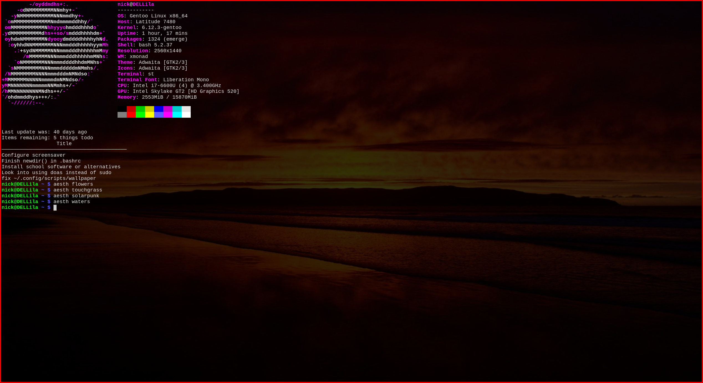

A sweet suite of system scripts developed by me for my system.

## Screenshots
# Aesthetics - collections of wallpapers
The program /usr/bin/aesth -> ~/.config/scripts/cpp/aesth runs the script aesth which switches between these aesthetics. Then it runs wallpaper to select a random one and apply it to the background.
- flowers

- touchgrass

- solarpunk

- waters

# Wallpaper - selects a random wallpaper from the current aesthetic
The program /usr/bin/wallpaper -> ~/.config/scripts/cpp/wallpaper runs the script wallpaper which selects a random wallpaper from the current aesthetic and applies it.
Demonstration from waters aesthetic
- Before

- After
